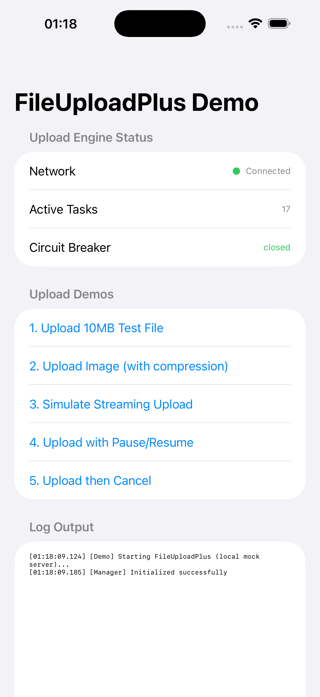
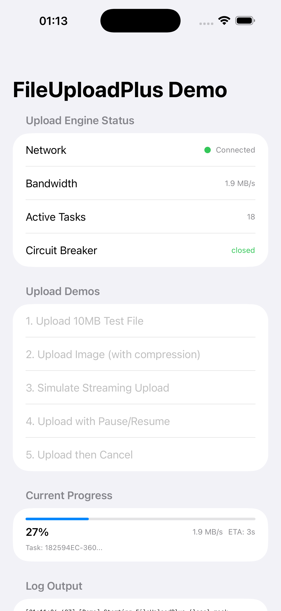
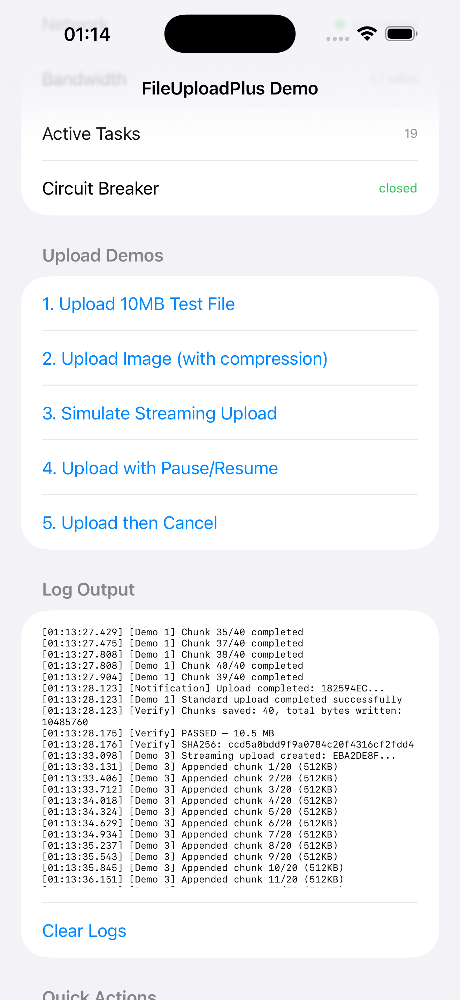

# FileUploadPlus

面向 iOS 全场景的商业级文件上传框架，支持断点续传、流式上传、多模块按需引入。

## 截图

### 主界面
 

## 功能特性

| 类别 | 功能 |
|------|------|
| **核心上传** | 分片上传、断点续传、自动重试（指数退避 + jitter）、自适应分片大小 |
| **并发控制** | OperationQueue 管理分片并发、TrafficController 拥塞控制、CircuitBreaker 熔断保护 |
| **流式上传** | `StreamingUploadHandle` 支持边写边传，无需知道文件总大小 |
| **安全校验** | 文件名校验（防路径遍历）、扩展名白/黑名单、分片级 SHA-256 校验、请求签名 |
| **加密** | 分片级 AES-GCM / ChaCha20-Poly1305 加密 |
| **管道** | 可组合的 Pre/Process/Post 管道阶段：校验 → 压缩 → 散列 → 通知 |
| **可观测性** | 实时速率、ETA、带宽追踪、日志服务（控制台 + 文件） |
| **后台上传** | URLSession background configuration 支持 |
| **下载** | 基于 downloadTask 的后台下载，Range 断点续传 |
| **云厂商兼容** | 阿里云 OSS、腾讯云 COS、AWS S3、自建服务 |

## 模块架构

```
FileUploadPlusCore         ← 零依赖（基础类型 + 协议）
    ↑
    ├── FileUploadPlusEngine     (上传引擎 + 任务调度)
    ├── FileUploadPlusServices   (认证 / 日志 / 校验 / 签名 / 加密)
    ├── FileUploadPlusPipeline   (管道：前置 → 处理 → 后置)
    ├── FileUploadPlusMetrics    (速率追踪 / 熔断器 / 流量控制)
    ├── FileUploadPlusDownload   (下载模块)
    ├── FileUploadPlusAPM        (性能监控)
    ├── FileUploadPlusCDN        (CDN 加速)
    ├── FileUploadPlusEncryption (端到端加密)
    ├── FileUploadPlusGRDB       (SQLite 状态持久化)
    ├── FileUploadPlusHealthCheck(健康检查)
    ├── FileUploadPlusNetwork    (网络策略)
    └── FileUploadPlusPreprocess (预处理)
```

## 按需引入

```swift
// 小项目 — 核心上传能力
import FileUploadPlusCore
import FileUploadPlusEngine

// 中型项目 — 加认证、校验、管道
import FileUploadPlusServices
import FileUploadPlusPipeline

// 大型项目 — 全功能一键导入
import FileUploadPlus
```

## 快速开始

### 基础上传

```swift
import FileUploadPlus

let config = UploadConfiguration()
config.chunkSize = 1 * 1024 * 1024     // 1MB 分片
config.maxConcurrentUploads = 3
config.urlBuilder = MyURLBuilder()
config.logService = ConsoleLogService()

let manager = try FileUploadManager(config: config)

let task = try manager.uploadFile(
    at: fileURL,
    metadata: ["userId": "123"]
) { error in
    if let error { print("Upload failed: \(error)") }
    else         { print("Upload complete!") }
}

task.onProgress = { progress in
    print("Progress: \(Int(progress * 100))%")
}
```

### 流式上传

```swift
let handle = try manager.createStreamingUpload(
    metadata: ["type": "video"]
)

// 边接收数据边上传，无需知道总大小
try handle.append(data: chunk1)
try handle.append(data: chunk2)
try handle.append(data: chunk3)
handle.finish()

handle.onComplete = { error in
    // 所有分片上传完成
}
```

### 暂停 / 恢复

```swift
try manager.pause(taskId: task.taskId)
// ...
try manager.resume(taskId: task.taskId)

// 或批量操作
manager.pauseAll()
manager.resumeAll()
```

### 管道配置

```swift
let pipeline = UploadPipeline(logger: logger)
pipeline.addStage(FileValidationStage(validators: config.validators, logger: logger))
pipeline.addStage(ImageCompressionStage(compressionQuality: 0.8, maxDimension: 2048))
pipeline.addStage(ChecksumStage(checker: SHA256IntegrityChecker()))
config.pipeline = pipeline
```

### 安全校验

```swift
config.validators = [
    FileSizeValidator(minBytes: 1, maxBytes: 100 * 1024 * 1024),
    FileTypeValidator(
        allowedExtensions: Set(["jpg", "png", "pdf"]),
        allowedMIMETypes: Set(["image/jpeg", "image/png"])
    ),
    FileNameValidator(
        maxNameLength: 255,
        blockedExtensions: Set(["exe", "sh", "dmg"])
    ),
]
```

### 可观测性

```swift
let metrics = UploadMetricsCollector()
metrics.onStatsUpdated = { stat in
    print("Speed: \(stat.formattedSpeed)  ETA: \(stat.formattedETA)")
}
config.metricsCollector = metrics

config.circuitBreaker = CircuitBreaker(
    name: "upload",
    failureThreshold: 5,
    recoveryTimeout: 30
)

config.trafficController = TrafficController(
    maxConcurrentChunks: 3,
    maxBytesPerSecond: 10 * 1024 * 1024  // 10MB/s
)
```

## Demo App

项目包含一个 SwiftUI 演示 App，覆盖全部上传场景：

| 场景 | 说明 |
|------|------|
| Upload 10MB File | 标准分片上传 + SHA-256 完整性校验 |
| Upload Image | 图片上传 + 自动压缩 |
| Streaming Upload | 模拟流式数据边写边传 |
| Pause/Resume | 20MB 上传中途暂停 2 秒再恢复 |
| Cancel | 上传中途取消并清理服务端 |

Demo 内置 `DemoURLProtocol` 本地 Mock Server，无需外部网络即可完整测试。

```
open FileUploadPlus.xcodeproj
# Cmd+R 运行 Demo
```

## 构建

```bash
# SPM
make build-spm

# Xcode
make build-xcode

# Release
make build-xcode-release

# 测试
make test

# 清理
make clean
```

## 云厂商兼容

| 厂商 | URLBuilder | RequestSigner |
|------|------------|---------------|
| 阿里云 OSS | `AliyunOSSUrlBuilder` | `AliyunOSSV2Signer` |
| 腾讯云 COS | `TencentCOSURLBuilder` | `TencentCOSSigner` |
| AWS S3 | `AWSS3URLBuilder` | `HMACSHA256Signer` |
| 自建服务 | `StandardURLBuilder` | `HMACSHA256Signer` |

## 扩展点

所有核心协议均可替换自定义实现：

| 协议 | 用途 |
|------|------|
| `URLBuilder` | 自定义后端 API URL 构造 |
| `RequestSigner` | 自定义请求签名算法 |
| `Authentication` | 自定义认证策略 |
| `Encryption` | 自定义加密算法 |
| `FileValidator` | 自定义文件校验规则 |
| `LogService` | 自定义日志输出 |
| `PipelineStageExecutor` | 自定义管道处理阶段 |
| `TrafficControlProtocol` | 自定义流量控制策略 |
| `CircuitBreakerProtocol` | 自定义熔断器策略 |
| `MetricsCollectorProtocol` | 自定义指标收集 |

## 数据流

```
uploadFile(at:)
  │
  ├─ 1. Pipeline.executePreUpload()   ← 校验 / 预处理
  ├─ 2. InitUpload → Server           ← 获取 uploadId
  ├─ 3. For each chunk:
  │     ├─ DataProvider.readData()
  │     ├─ Pipeline.processChunk()    ← 压缩 / 散列 / 加密
  │     ├─ TrafficController          ← 拥塞控制
  │     └─ NetworkClient.uploadChunk()
  ├─ 4. CompleteUpload → Server
  └─ 5. Pipeline.executePostUpload()  ← 通知 / 指标
```

## 最低要求

- iOS 15.0+ / macOS 12.0+
- Swift 5.9+
- Xcode 15+

## 更多文档

- [架构设计文档](ARCHITECTURE.md)
